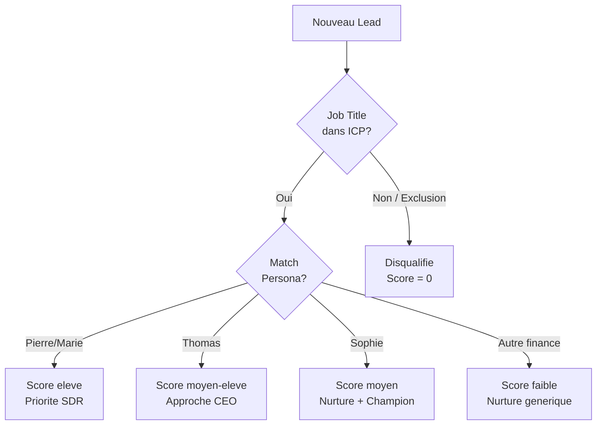

# ICP & Buyer Personas

> [!info] Vue d'ensemble
> L'ICP (Ideal Customer Profile) et les buyer personas definissent **qui** EMAsphere cible et **comment** les messages sont adaptes. Ces definitions alimentent directement le [[leadgen/lead-scoring|scoring]], le [[leadgen/cleaning-rules|nettoyage des donnees]], et les [[campaigns/lemlist-sequences|sequences outreach]].

---

## ICP -- Ideal Customer Profile

### Criteres de Qualification Entreprise

| Critere | Valeur Ideale | Acceptable | Exclusion |
|---------|--------------|------------|-----------|
| **Industrie** | Manufacturing, Professional Services, Technology | Healthcare, Financial Services, Retail, Logistics | Non-profit, Government, Education (sauf B-school) |
| **Taille (employes)** | 100-500 (sweet spot) | 50-1000 | < 10 ou > 5000 |
| **Geographie** | France, Belgique | UK, Ireland | -- (ROW accepte mais faible priorite) |
| **Chiffre d'affaires** | 50M-200M EUR | 10M-500M EUR | < 5M EUR |
| **Structure** | Multi-entites, filiales | Mono-entite complexe | Micro-entreprise simple |
| **Signaux** | Reporting financier complexe, consolidation | Croissance rapide, restructuration | Pas de besoin financier identifie |

### Industries ICP Detaillees

#### Exact Match ICP (15 pts scoring)

| Industrie | Justification | Pain Points Typiques |
|-----------|---------------|---------------------|
| **Manufacturing** | Multiples sites, consolidation complexe, besoin de visibilite production-finance | Reporting multi-sites, consolidation inter-entites, suivi de marge par produit |
| **Professional Services** | Structure multi-bureaux, facturation complexe, suivi de rentabilite par projet | Rentabilite par mission, cash flow previsionnel, time tracking vs facturation |
| **Technology** | Croissance rapide, multiples KPIs, investisseurs exigeants | Burn rate, MRR/ARR reporting, consolidation apres levee de fonds |
| **Healthcare** | Reglementation, multiples etablissements, reporting obligatoire | Conformite financiere, consolidation multi-etablissements, budgets contraints |
| **Financial Services** | Reporting reglementaire, multi-entites, complexite comptable | Conformite, consolidation, reporting temps reel pour les clients |

#### Industries Adjacentes (8 pts scoring)

| Industrie | Potentiel | Condition |
|-----------|-----------|-----------|
| Retail | Moyen | Multi-sites, 100+ employes |
| Logistics | Moyen | Flotte + entrepots, complexite operationnelle |
| Construction | Moyen | Multi-projets, suivi de rentabilite chantier |
| Education (prive) | Faible-Moyen | Multi-campus, >200 employes |
| Real Estate | Moyen | Portefeuille multi-actifs |

Voir [[leadgen/lead-scoring#1. Industry Match (max 15 pts)]] pour l'impact sur le scoring et [[leadgen/cleaning-gmt]] pour la liste `industry_emalist`.

---

## Les 4 Buyer Personas

### Pierre le CFO

> [!abstract] Fiche Persona

| Attribut | Detail |
|----------|--------|
| **Titre** | CFO / DAF (Directeur Administratif et Financier) |
| **Niveau** | C-Level |
| **Age typique** | 40-55 ans |
| **Anciennete** | 5-15 ans dans le role |
| **Reporting** | CEO / Board |
| **Equipe** | 5-20 personnes (finance, comptabilite, controle de gestion) |

**Pain Points :**
- Reporting manuel chronophage (Excel, copier-coller entre systemes)
- Consolidation lente et source d'erreurs (multi-entites)
- Manque de visibilite temps reel sur la performance financiere
- Pression du board pour des KPIs fiables et rapides
- Clotures mensuelles qui prennent 2-3 semaines au lieu de 2-3 jours

**Motivations :**
- Gagner du temps sur les taches repetitives
- Decisions data-driven avec des donnees fiables
- Impressionner le board avec un reporting professionnel
- Se concentrer sur l'analyse strategique plutot que la production de chiffres

**Objections courantes :**
- "Notre budget IT est deja serre cette annee"
- "On a deja investi dans SAP/Oracle, pourquoi un outil de plus ?"
- "Le changement de process va perturber l'equipe"
- "Combien de temps pour voir le ROI ?"

**Canaux preferes :** Email professionnel, LinkedIn, evenements finance (CFO Summit, etc.)

**Score potentiel :** 25 pts (titre, poids 3) + 15 pts (C-Level) = **40 pts contact minimum**

---

### Marie la Finance Director

> [!abstract] Fiche Persona

| Attribut | Detail |
|----------|--------|
| **Titre** | Finance Director / Directrice Financiere |
| **Niveau** | Director |
| **Age typique** | 35-50 ans |
| **Anciennete** | 3-10 ans dans le role |
| **Reporting** | CFO |
| **Equipe** | 3-10 personnes |

**Pain Points :**
- Multiples outils non connectes (ERP, Excel, BI, compta)
- Erreurs de saisie et de reconciliation entre systemes
- Temps passe a formater des rapports plutot qu'a analyser
- Difficulte a repondre aux demandes ad hoc du CFO/board

**Motivations :**
- Automatisation des taches repetitives
- Fiabilite des donnees (une seule source de verite)
- Evolution de carriere (montrer sa capacite a moderniser)
- Reduire le stress des clotures

**Objections courantes :**
- "Est-ce que ca s'integre avec notre ERP {X} ?"
- "On a deja essaye un outil similaire et ca n'a pas marche"
- "La migration de donnees me fait peur"
- "Mon equipe n'est pas tech-savvy"

**Canaux preferes :** Email professionnel, LinkedIn, webinaires, case studies

**Score potentiel :** 25 pts (titre, poids 3) + 10 pts (Director) = **35 pts contact minimum**

---

### Thomas le Managing Director

> [!abstract] Fiche Persona

| Attribut | Detail |
|----------|--------|
| **Titre** | Managing Director / Directeur General |
| **Niveau** | C-Level |
| **Age typique** | 45-60 ans |
| **Anciennete** | 5-20 ans dans le role |
| **Reporting** | Board / Actionnaires |
| **Equipe** | Direction generale |

**Pain Points :**
- Pas de vue d'ensemble temps reel sur la performance de l'entreprise
- Dependance aux equipes finance pour obtenir les chiffres
- Delai entre la demande d'info et la reponse (jours voire semaines)
- Incapacite a piloter rapidement en cas de crise

**Motivations :**
- Vision strategique autonome (dashboard personnel)
- Autonomie par rapport aux equipes finance pour les KPIs cles
- Pilotage agile de l'entreprise
- Credibilite aupres des investisseurs/actionnaires

**Objections courantes :**
- "Je ne vois pas le ROI immediat"
- "C'est trop complexe pour ce que j'en ai besoin"
- "Mon CFO gere deja ca"
- "On verra au prochain budget"

**Canaux preferes :** LinkedIn (contenu court), recommendations de pairs, evenements dirigeants

**Score potentiel :** 17 pts (titre, poids 2) + 15 pts (C-Level) = **32 pts contact minimum**

---

### Sophie la Controller

> [!abstract] Fiche Persona

| Attribut | Detail |
|----------|--------|
| **Titre** | Controller / RAF (Responsable Administratif et Financier) |
| **Niveau** | Manager |
| **Age typique** | 30-45 ans |
| **Anciennete** | 2-8 ans dans le role |
| **Reporting** | CFO / Finance Director |
| **Equipe** | 1-5 personnes |

**Pain Points :**
- Clotures mensuelles longues et penibles
- Reconciliation manuelle entre systemes
- Pression pour reduire les delais de cloture
- Gestion des inter-cos (intercompany) complexe

**Motivations :**
- Precision et fiabilite des donnees
- Rapidite de cloture (de 15j a 5j)
- Reconnaissance professionnelle (moderniser le departement)
- Moins de stress, meilleur equilibre vie pro/perso

**Objections courantes :**
- "La migration de donnees historiques est risquee"
- "Je ne suis pas decision-maker pour cet achat"
- "Notre process actuel fonctionne, meme s'il est lent"
- "Il faudrait convaincre mon CFO d'abord"

**Canaux preferes :** Email professionnel, LinkedIn, webinaires techniques, demos produit

**Score potentiel :** 8 pts (titre, poids 1) + 5 pts (Manager) = **13 pts contact minimum**

> [!warning] Note sur Sophie
> Sophie a le score contact le plus bas mais est souvent l'**utilisatrice principale** du produit. Elle peut etre une **championne interne** qui influence le CFO. Strategie : cibler Sophie pour le nurture et le contenu educatif, mais prioriser Pierre et Marie pour le contact direct SDR.

---

## Mapping Persona --> Job Title Rules

Correspondance entre les personas et les `jobTitleRules` du [[leadgen/cleaning-gmt|GMT]] :

| Persona | Titres Inclus (jobTitleRules) | Poids |
|---------|------------------------------|-------|
| **Pierre le CFO** | CFO, Chief Financial Officer, DAF, Directeur Administratif et Financier | 3 |
| **Marie la FD** | Finance Director, Directrice Financiere, Head of Finance, VP Finance | 2-3 |
| **Thomas le MD** | Managing Director, Directeur General, CEO (si PME), Country Manager | 2 |
| **Sophie la Controller** | Controller, RAF, Responsable Administratif et Financier, Financial Controller | 1 |

---

## Mapping Persona --> Content Topics

| Persona | Topics Prioritaires | Format Prefere |
|---------|--------------------|---------=------|
| **Pierre le CFO** | ROI, transformation digitale finance, benchmarks secteur, tendances CFO | Executive summary, infographie, evenement |
| **Marie la FD** | Automatisation reporting, integration ERP, best practices consolidation | Webinaire, case study, guide technique |
| **Thomas le MD** | Vision d'ensemble, dashboard CEO, pilotage agile, temoignages pairs | Article court, video, LinkedIn post |
| **Sophie la Controller** | Cloture rapide, reconciliation, templates reporting, tutoriels | Demo produit, webinaire technique, checklist |

Voir [[content/brand-voice]] pour le ton et le style des communications et [[content/editorial-calendar]] pour le planning editorial.

---

## Negative Personas (Exclusions)

> [!danger] Titres Exclus
> Les profils suivants ne sont **jamais** des decision-makers ou influenceurs pour une solution de reporting financier. Ils sont automatiquement disqualifies (score = 0) par les `jobTitleRules` du [[leadgen/cleaning-gmt|GMT]].

| Departement Exclu | Titres Typiques | Raison |
|-------------------|-----------------|--------|
| **Marketing** | CMO, Marketing Director, Marketing Manager, Growth Hacker | Pas de besoin financier, pas de budget |
| **HR** | CHRO, HR Director, HR Manager, Talent Acquisition | Departement sans lien avec le reporting financier |
| **Sales** | CSO, Sales Director, Sales Manager, Account Executive | Pas decision-maker pour outils finance |
| **IT** | CTO, IT Director, IT Manager, DevOps, Engineer | Peut etre consulte mais jamais decision-maker |
| **Operations** | COO, Operations Director, Supply Chain Manager | Sauf si role hybride finance-operations (a evaluer manuellement) |

> [!note] Exception Operations
> Certains profils Operations dans les PME cumulent des responsabilites financieres (ex: "Operations & Finance Director"). Ces cas doivent etre evalues manuellement par le SDR. Le scoring automatique les exclut par defaut.

Confirme par les regles de [[leadgen/lead-scoring#Regles de Disqualification Automatique]].

---

## Application dans le Pipeline

---

## Liens

- [[business/vision]] -- Vision strategique EMAsphere
- [[business/strategy]] -- Strategie commerciale
- [[business/roadmap]] -- Roadmap produit et commercial
- [[leadgen/lead-scoring]] -- Scoring et impact des personas
- [[leadgen/cleaning-rules]] -- Regles de nettoyage
- [[leadgen/cleaning-gmt]] -- GMT (jobTitleRules, industry_emalist)
- [[crm/hubspot-properties]] -- Proprietes de segmentation
- [[crm/hubspot-lifecycle]] -- Lifecycle stages par persona
- [[content/brand-voice]] -- Ton adapte par persona
- [[content/editorial-calendar]] -- Planning editorial par persona
- [[campaigns/lemlist-sequences]] -- Sequences outreach par persona
