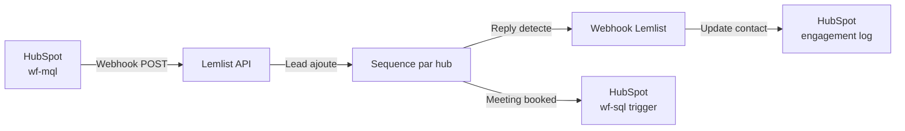

# Lemlist -- Sequences & Outreach

> [!info] Vue d'ensemble
> Les sequences d'outreach constituent le moteur de conversion MQL --> SQL. Elles sont multilingues (FR, NL, EN) et adaptees par [[leadgen/geographic-hubs|hub geographique]].

> [!warning] Status
> **Non configure** -- en attente de la decision finale entre Lemlist et HubSpot Sequences. Ce document decrit l'architecture cible quelle que soit la plateforme choisie.

---

## Decision Ouverte : Lemlist vs HubSpot Sequences

### Comparatif

| Critere | Lemlist | HubSpot Sequences |
|---------|---------|-------------------|
| **Multi-canal** | Email + LinkedIn + Phone + SMS | Email + LinkedIn (limite) |
| **Personnalisation** | Variables illimitees, images custom, landing pages | Variables HubSpot, templates |
| **A/B Testing** | Natif (subject, body, timing) | Limite |
| **Warmup** | Lemwarm integre | Non inclus (outil tiers) |
| **Integration HubSpot** | Via API/webhook (2-way sync) | Natif (meme plateforme) |
| **Prix** | ~$99/mois/seat | Inclus dans Sales Hub Pro |
| **Reporting** | Dashboard dedie, granulaire | Dashboard HubSpot unifie |
| **Delivrabilite** | Gestion avancee (rotation domaines, throttling) | Basique |
| **LinkedIn automation** | Natif (connexion, message, visit) | Via HubSpot Sales extension |
| **Scalabilite** | Concu pour le volume outbound | Limites d'envoi plus strictes |

### Recommandation Preliminaire

> [!tip] Analyse
> **Lemlist** est recommande pour la phase initiale (volume outbound, multi-canal, warmup). A terme, une migration vers **HubSpot Sequences** peut etre envisagee si le volume diminue et que l'integration native devient prioritaire.

### Decision Requise

- [ ] Valider le budget Lemlist ($99/mois/seat)
- [ ] Tester les deux outils sur un batch de 50 leads
- [ ] Mesurer delivrabilite et taux de reponse
- [ ] Decision finale avant lancement des campagnes

---

## Sequences Planifiees par Hub

### Sequence FR (France + BE South)

| Step | Jour | Canal | Objet/Action |
|------|------|-------|-------------|
| 1 | J+0 | Email | Introduction personnalisee -- pain point {industry} |
| 2 | J+3 | Email | Follow-up avec cas d'usage {companySize} |
| 3 | J+7 | LinkedIn | Connexion + message personnalise |
| 4 | J+14 | Email | Derniere relance + CTA demo |

**Template FR -- Step 1 (exemple)** :

```
Objet: {firstName}, une question sur votre reporting financier

Bonjour {firstName},

Je me permets de vous contacter car {companyName} correspond
au profil d'entreprises que nous accompagnons dans le secteur
{industry}.

En tant que {jobTitle}, vous etes probablement confronte(e) a
[pain point specifique au persona].

EMAsphere aide les entreprises de {employees_category} employes
a automatiser leur reporting financier et gagner en visibilite.

Seriez-vous disponible pour un echange de 15 minutes cette semaine ?

Cordialement,
[Signature SDR]
```

### Sequence NL (BE North)

| Step | Jour | Canal | Objet/Action |
|------|------|-------|-------------|
| 1 | J+0 | Email | Gepersonaliseerde introductie -- pain point {industry} |
| 2 | J+3 | Email | Follow-up met use case {companySize} |
| 3 | J+7 | LinkedIn | Connectieverzoek + gepersonaliseerd bericht |
| 4 | J+14 | Email | Laatste opvolging + CTA demo |

### Sequence EN (UK + ROW)

| Step | Jour | Canal | Objet/Action |
|------|------|-------|-------------|
| 1 | J+0 | Email | Personalized introduction -- {industry} pain point |
| 2 | J+3 | Email | Follow-up with {companySize} use case |
| 3 | J+7 | LinkedIn | Connection request + personalized message |
| 4 | J+14 | Email | Final follow-up + demo CTA |

> [!note] Timing
> Les jours sont **ouvrables** (lundi-vendredi). Les envois sont programmes entre 8h-10h heure locale du destinataire pour maximiser les taux d'ouverture.

---

## Variables de Personnalisation

| Variable | Source | Exemple |
|----------|--------|---------|
| `{firstName}` | HubSpot `firstname` | Pierre |
| `{lastName}` | HubSpot `lastname` | Dupont |
| `{companyName}` | HubSpot `company` | Acme Corp |
| `{jobTitle}` | HubSpot `jobtitle` | CFO |
| `{industry}` | HubSpot `industry` | Manufacturing |
| `{employees_category}` | HubSpot custom prop | 201-500 |
| `{geographic_hub}` | HubSpot custom prop | France |
| `{custom_icebreaker}` | Enrichissement manuel ou IA | "Felicitations pour votre recente levee de fonds" |

### Icebreakers Automatiques

Les icebreakers peuvent etre generes automatiquement par [[agents/iris-memory|Iris]] ou [[agents/scout-memory|Scout]] a partir de :
- Actualites recentes de l'entreprise (levee de fonds, acquisition, nomination)
- Posts LinkedIn recents du contact
- Contenu publie sur le site web de l'entreprise

---

## Metriques Cibles

| Metrique | Objectif | Benchmark Industrie | Seuil Alerte |
|----------|----------|---------------------|-------------|
| **Open Rate** | > 50% | 40-60% (cold outbound B2B) | < 30% |
| **Reply Rate** | > 5% | 3-8% | < 2% |
| **Meeting Booked Rate** | > 1% | 0.5-2% | < 0.3% |
| **Bounce Rate** | < 3% | 2-5% | > 5% |
| **Unsubscribe Rate** | < 1% | 0.5-2% | > 2% |
| **Spam Complaint Rate** | < 0.1% | < 0.1% | > 0.05% |

> [!danger] Seuils d'alerte
> Si un seuil d'alerte est depasse, la campagne doit etre **immediatement pausee** pour investigation. Causes possibles : liste de mauvaise qualite, template mal cible, probleme de delivrabilite. Voir [[leadgen/monitoring]] pour les alertes.

---

## Integration HubSpot

### Flux d'Enrollment



### Sync Bidirectionnel

| Evenement Lemlist | Action HubSpot |
|-------------------|----------------|
| Email sent | Log engagement (EMAIL) |
| Email opened | Update `last_engagement_date` |
| Email clicked | Update `last_engagement_date` + log |
| Email replied | Set `hs_lead_status` = CONNECTED, log engagement |
| Meeting booked | Trigger [[crm/hubspot-workflows|wf-sql]] |
| Email bounced | Trigger [[crm/hubspot-workflows|wf-bounce]] |
| Unsubscribed | Set `hs_email_optout` = true |

Voir [[crm/hubspot-workflows]] pour les workflows declenches et [[crm/hubspot-properties]] pour les proprietes mises a jour.

---

## A/B Testing

### Elements Testables

| Element | Variantes | Metrique Cle |
|---------|-----------|-------------|
| **Subject line** | 2-3 variantes par step | Open Rate |
| **CTA** | Demo vs Echange vs Audit gratuit | Reply Rate |
| **Timing** | Mardi 8h vs Jeudi 10h | Open Rate |
| **Sequence length** | 3 steps vs 4 steps vs 5 steps | Meeting Booked Rate |
| **Canal Step 3** | LinkedIn vs Phone vs Email | Reply Rate |

### Protocole de Test

1. Split aleatoire 50/50 (minimum 100 leads par variante)
2. Duree minimum : 2 semaines completes
3. Significativite statistique : p < 0.05
4. Variante gagnante deployee sur 100% du hub

---

## Warmup & Delivrabilite

### Domain Reputation

| Action | Detail |
|--------|--------|
| **Domaine dedie** | Utiliser un sous-domaine pour l'outbound (ex: `outreach.emasphere.com`) |
| **SPF/DKIM/DMARC** | Configurer avant tout envoi |
| **Lemwarm** | Activer Lemwarm 2 semaines avant le premier envoi |
| **Volume progressif** | Semaine 1: 10/jour, Semaine 2: 25/jour, Semaine 3: 50/jour, Semaine 4+: 100/jour |

### Sending Limits

| Parametre | Valeur Recommandee |
|-----------|-------------------|
| Max emails/jour/boite | 100 |
| Max emails/heure/boite | 30 |
| Delai entre emails | 60-120 secondes |
| Rotation boites | 3 boites minimum par hub |

---

## Unsubscribe & RGPD

> [!danger] Conformite RGPD
> Toute communication outbound doit respecter le RGPD. Le non-respect expose a des amendes jusqu'a 4% du CA mondial.

| Mesure | Implementation |
|--------|---------------|
| **Lien unsubscribe** | Obligatoire dans chaque email, 1-clic |
| **Opt-out automatique** | Unsubscribe Lemlist --> sync HubSpot (`hs_email_optout` = true) |
| **Base legale** | Interet legitime (B2B prospection) -- documenter dans le registre |
| **Droit d'acces/effacement** | Process manuel via HubSpot (supprimer contact + purger Lemlist) |
| **Retention** | Contacts non engages supprimes apres 12 mois |
| **Documentation** | Registre de traitement a jour, DPO informe |

### Sync Unsubscribe

```
Lemlist Unsubscribe Event --> Webhook --> HubSpot
  1. Set hs_email_optout = true
  2. Remove from all active sequences
  3. Set hs_lead_status = UNQUALIFIED
  4. Log reason: "Unsubscribed from outreach"
```

---

## Liens

- [[crm/hubspot-workflows]] -- Workflows d'enrollment et sync
- [[crm/hubspot-properties]] -- Proprietes de tracking engagement
- [[crm/hubspot-lifecycle]] -- Impact sur les transitions lifecycle
- [[leadgen/geographic-hubs]] -- Hubs et selection de sequence par langue
- [[leadgen/lead-scoring]] -- Scoring et seuils d'enrollment
- [[leadgen/pipeline-overview]] -- Vue d'ensemble du pipeline
- [[content/brand-voice]] -- Ton et style des communications
- [[business/strategy]] -- Strategie commerciale globale
- [[operations/kpis]] -- Metriques de suivi des campagnes
