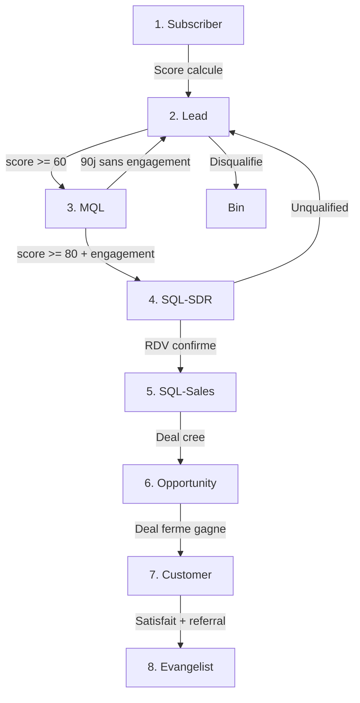

# HubSpot -- Lifecycle Stages & Funnel

> [!info] Vue d'ensemble
> Le lifecycle stage definit la position d'un contact dans le funnel de vente EMAsphere. Il determine les actions marketing et commerciales applicables, les workflows actifs, et les metriques de suivi.

---

## Les 8 Lifecycle Stages

### Detail par Stage

| # | Stage | Critere d'entree | Score | Actions | Responsable |
|---|-------|-----------------|-------|---------|-------------|
| 1 | **Subscriber** | Opt-in newsletter, formulaire web | N/A (pas de scoring) | Welcome email, nurture content | Marketing auto |
| 2 | **Lead** | Importe depuis [[prospects/pipeline]], score < 60 | < 60 | Enrichissement, nettoyage, scoring | [[agents/aria-memory\|Aria]] |
| 3 | **MQL** | Score >= 60 | 60-79 | Campagne [[campaigns/lemlist-sequences\|Lemlist]], suivi engagement | Marketing / Aria |
| 4 | **SQL-SDR** | Score >= 80 + engagement detecte | >= 80 | Premier contact SDR sous 24h | SDR (par hub) |
| 5 | **SQL-Sales** | Rendez-vous confirme avec commercial | >= 80 | Transfert au commercial, prep meeting | Commercial |
| 6 | **Opportunity** | Deal cree dans HubSpot | -- | Pipeline commercial actif, negociation | Commercial |
| 7 | **Customer** | Deal ferme gagne | -- | Onboarding, support, success | Customer Success |
| 8 | **Evangelist** | Client satisfait, potentiel referral/upsell | -- | Programme referral, upsell | Account Manager |

---

## hs_lead_status -- Valeurs

Le `hs_lead_status` est un complement au lifecycle stage qui indique le **statut operationnel** du lead dans son stage actuel.

| Valeur | Description | Lifecycle Stages Applicables |
|--------|-------------|------------------------------|
| `NEW` | Vient d'etre importe, pas encore traite | Lead, MQL |
| `OPEN` | En attente de traitement | Lead, MQL, SQL-SDR |
| `IN_PROGRESS` | En cours de qualification/contact | MQL, SQL-SDR, SQL-Sales |
| `OPEN_DEAL` | Deal actif en cours | Opportunity |
| `UNQUALIFIED` | Disqualifie apres evaluation | Lead (retrogradation) |
| `ATTEMPTED_TO_CONTACT` | Tentative de contact sans reponse | SQL-SDR |
| `CONNECTED` | Contact etabli, echange en cours | SQL-SDR, SQL-Sales |
| `BAD_TIMING` | Interesse mais pas maintenant, recontacter plus tard | MQL, SQL-SDR |

> [!tip] Combinaison Lifecycle + Lead Status
> Le lifecycle stage indique **ou** se trouve le contact dans le funnel. Le lead status indique **comment** il progresse dans ce stage. Exemple : un contact peut etre `SQL-SDR` + `ATTEMPTED_TO_CONTACT` (SDR a essaye de le joindre).

Voir [[crm/hubspot-properties]] pour les definitions techniques de ces proprietes.

---

## Transitions Automatiques vs Manuelles

| Transition | Type | Trigger / Condition | Workflow |
|------------|------|---------------------|----------|
| Import --> Lead | **Auto** | Nouveau contact importe | [[crm/hubspot-workflows\|wf-new-lead]] |
| Lead --> MQL | **Auto** | `lead_score_total` >= 60 | [[crm/hubspot-workflows\|wf-mql]] |
| MQL --> SQL-SDR | **Auto** | `lead_score_total` >= 80 + engagement (email ouvert/clic/reponse) | [[crm/hubspot-workflows\|wf-sql]] |
| SQL-SDR --> SQL-Sales | **Manuel** | SDR confirme le rendez-vous | SDR met a jour manuellement |
| SQL-Sales --> Opportunity | **Manuel** | Commercial cree un deal | Creation deal dans HubSpot |
| Opportunity --> Customer | **Auto** | Deal stage = "Closed Won" | Workflow HubSpot natif |
| Customer --> Evangelist | **Manuel** | Evaluation satisfaction + potentiel | Account Manager |
| MQL --> Lead (retrogradation) | **Auto** | 90 jours sans engagement | [[crm/hubspot-workflows\|wf-stale]] |
| SQL-SDR --> Lead (retrogradation) | **Auto** | SDR set status = UNQUALIFIED | Workflow retrogradation |
| Tout stage --> Bin | **Auto/Manuel** | Disqualification (voir [[leadgen/lead-scoring#Regles de Disqualification Automatique]]) | Workflow disqualification |

---

## Metriques par Stage

### Volume et Conversion

| Stage | Volume Cible (mensuel) | Taux Conversion vers Stage+1 | Temps Moyen dans Stage |
|-------|----------------------|-------------------------------|----------------------|
| Subscriber | Variable | N/A (flux separe) | N/A |
| Lead | 500-1000 | 40-50% vers MQL | 7 jours |
| MQL | 200-500 | 30-40% vers SQL-SDR | 14 jours |
| SQL-SDR | 60-200 | 25-35% vers SQL-Sales | 7 jours |
| SQL-Sales | 15-70 | 40-50% vers Opportunity | 14 jours |
| Opportunity | 6-35 | 20-30% vers Customer | 60-90 jours |
| Customer | 1-10 | N/A | Ongoing |
| Evangelist | -- | N/A | Ongoing |

> [!note] Metriques a ajuster
> Ces cibles sont des estimations initiales basees sur les benchmarks SaaS B2B. Elles seront ajustees apres les 3 premiers mois d'operation. Voir [[operations/kpis]] pour le suivi en temps reel.

### Funnel Metrics Dashboard

| Metrique | Formule | Objectif |
|----------|---------|----------|
| Lead-to-MQL Rate | MQL / Total Leads | > 40% |
| MQL-to-SQL Rate | SQL / MQL | > 30% |
| SQL-to-Opportunity Rate | Opportunities / SQL-Sales | > 40% |
| Opportunity-to-Customer Rate | Customers / Opportunities | > 20% |
| Full Funnel Rate | Customers / Total Leads | > 1% |
| Average Sales Cycle | Date Customer - Date Lead | < 90 jours |

---

## Workflows HubSpot pour Transitions Automatiques

| Workflow | Trigger | Actions |
|----------|---------|---------|
| `wf-new-lead` | Contact cree (import) | Set lifecycle=Lead, set lead_status=NEW, assign owner par hub, calculer score |
| `wf-mql` | `lead_score_total` >= 60 | Set lifecycle=MQL, enroll [[campaigns/lemlist-sequences\|sequence Lemlist]], notifier marketing |
| `wf-sql` | `lead_score_total` >= 80 + engagement | Set lifecycle=SQL-SDR, notifier SDR, creer tache de contact |
| `wf-stale` | Aucune activite 90 jours sur MQL | Set lifecycle=Lead, set lead_status=UNQUALIFIED |
| `wf-nurture` | Score < 60 apres 30 jours | Enroll nurture sequence |
| `wf-retro-sdr` | SDR set UNQUALIFIED | Set lifecycle=Lead, logger raison |

Voir [[crm/hubspot-workflows]] pour les details complets de chaque workflow.

---

## Regles de Retrogradation

> [!warning] Retrogradations
> Les retrogradations protegent la qualite du pipeline en retirant les contacts inactifs ou disqualifies des stages actifs.

| Regle | Condition | Retrogradation | Nouveau Status |
|-------|-----------|----------------|----------------|
| **Stale MQL** | MQL sans engagement (open, click, reply) pendant 90 jours | MQL --> Lead | UNQUALIFIED |
| **Bad Timing** | Contact explicitement reporte ("pas maintenant", "recontactez-moi dans 6 mois") | Reste dans stage actuel | BAD_TIMING |
| **SDR Unqualified** | SDR determine que le contact n'est pas qualifie apres echange | SQL-SDR --> Lead | UNQUALIFIED |
| **Bounced Unique** | Email unique bounced, pas d'alternative | Stage actuel --> Bin | -- |
| **Duplicate** | Contact detecte comme doublon | Fusionne avec le contact principal | -- |

> [!tip] Bad Timing vs Unqualified
> **Bad Timing** n'est PAS une retrogradation mais un **gel**. Le contact reste dans son stage avec une date de recontact. Un workflow de rappel le reactive a la date prevue.
> **Unqualified** est une retrogradation definitive (sauf re-scoring manuel).

---

## Integration avec le Pipeline Commercial

Quand un contact atteint le stage **Opportunity**, un deal est cree dans le pipeline commercial HubSpot :

| Deal Stage | Correspondance Lifecycle | Probabilite |
|------------|-------------------------|-------------|
| Qualification | SQL-Sales | 10% |
| Meeting Scheduled | SQL-Sales | 20% |
| Presentation | Opportunity | 40% |
| Proposal Sent | Opportunity | 60% |
| Negotiation | Opportunity | 80% |
| Closed Won | Customer | 100% |
| Closed Lost | -- (archive) | 0% |

---

## Liens

- [[leadgen/lead-scoring]] -- Regles de scoring et seuils MQL/SQL
- [[crm/hubspot-properties]] -- Proprietes HubSpot utilisees
- [[crm/hubspot-workflows]] -- Workflows d'automatisation
- [[crm/hubspot-backlog]] -- Backlog d'optimisation HubSpot
- [[prospects/pipeline]] -- Pipeline prospects actif
- [[operations/kpis]] -- KPIs et metriques de suivi
- [[campaigns/lemlist-sequences]] -- Sequences outreach par stage
- [[business/icp-personas]] -- ICP et personas pour qualification
