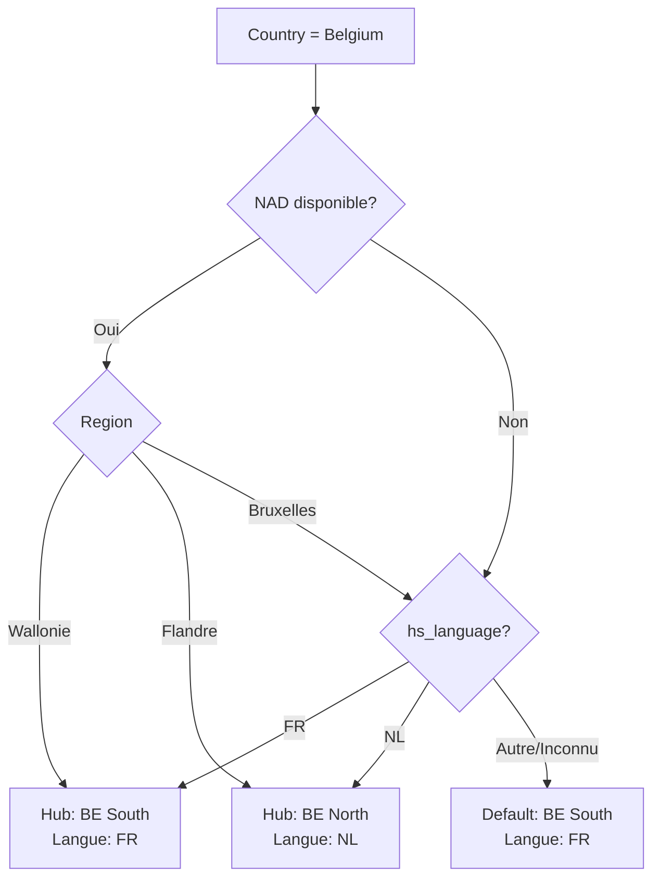

# Hubs Geographiques -- Routing & Attribution

> [!info] Vue d'ensemble
> L'attribution geographique est un pilier du pipeline leadgen EMAsphere. Chaque lead est assigne a un **hub** qui determine la langue de communication, le SDR responsable, et les sequences outreach appropriees.

---

## Les 5 Hubs

| Hub | Pays/Region | Langue | TLD | Workflow HubSpot | SDR Owner |
|-----|-------------|--------|-----|-----------------|-----------|
| **France** | France | FR | `.fr` | `wf-france` | SDR France |
| **BE South** | Belgique Wallonie | FR | `.be` | `wf-be-south` | SDR BE-FR |
| **BE North** | Belgique Flandre | NL | `.be` | `wf-be-north` | SDR BE-NL |
| **UK** | United Kingdom, Ireland | EN | `.co.uk`, `.uk`, `.ie` | `wf-uk` | SDR UK |
| **ROW** | Tous les autres pays | EN (default) | `*` | `wf-row` | SDR ROW |

> [!note] Priorite des marches
> - **Marche primaire** (10 pts scoring) : France, Belgique -- voir [[leadgen/lead-scoring]]
> - **Marche secondaire** (7 pts scoring) : UK, Ireland
> - **ROW** (3 pts scoring) : Tous les autres

---

## Logique de Resolution Belgique

La Belgique est le cas le plus complexe car elle est trilingue et divisee en regions administratives distinctes. La resolution utilise le champ **NAD** (National Administrative Division).



### Provinces par Region

#### Wallonie (FR) --> BE South

| Province | Code |
|----------|------|
| Hainaut | WHT |
| Liege | WLG |
| Luxembourg | WLX |
| Namur | WNA |
| Brabant wallon | WBR |

#### Flandre (NL) --> BE North

| Province | Code |
|----------|------|
| Antwerpen | VAN |
| Limburg | VLI |
| Oost-Vlaanderen | VOV |
| West-Vlaanderen | VWV |
| Vlaams-Brabant | VBR |

#### Bruxelles-Capitale

| Region | Logique |
|--------|---------|
| Bruxelles / Brussels | Check `hs_language` du contact |
| Si `hs_language` = FR | --> BE South |
| Si `hs_language` = NL | --> BE North |
| Si inconnu | --> **Default FR (BE South)** |

> [!warning] Cas Bruxelles
> Bruxelles est officiellement bilingue. Le **default est FR** car la majorite des decision-makers financiers a Bruxelles communiquent en francais. Ce default peut etre ajuste si les donnees de conversion montrent un biais. Voir [[operations/kpis]] pour le suivi.

---

## Attribution Post-Import

L'attribution se fait automatiquement a l'import via les [[crm/hubspot-workflows|workflows HubSpot]]. La chaine de resolution est :

```
Country + Postal Code + Language + TLD --> Hub --> Owner SDR
```

### Algorithme de Resolution

1. **Country** : premier critere de tri
   - France --> Hub France (fin)
   - UK / Ireland --> Hub UK (fin)
   - Belgium --> etape 2
   - Autre --> Hub ROW (fin)

2. **NAD / Province** (Belgique uniquement) :
   - Province Wallonie --> BE South
   - Province Flandre --> BE North
   - Bruxelles --> etape 3
   - NAD manquant --> etape 3

3. **Language Resolution** :
   - `hs_language` = FR --> BE South
   - `hs_language` = NL --> BE North
   - Inconnu --> check TLD

4. **TLD Fallback** :
   - `.be` sans autre info --> BE South (default FR)

### Proprietes HubSpot Utilisees

| Propriete | Source | Usage |
|-----------|--------|-------|
| `country` | Import / enrichissement | Tri primaire |
| `zip` | Import / enrichissement | Validation region |
| `state` / `nad` | Import / enrichissement | Province Belgique |
| `hs_language` | Import / detection | Resolution langue |
| `website` / `tld` | Import / enrichissement | TLD fallback |
| `geographic_hub` | Calcule | Hub assigne |
| `hubspot_owner_id` | Workflow | SDR assigne |

Voir [[crm/hubspot-properties]] pour les definitions completes.

---

## Language Resolution -- languageMap

La `languageMap` couvre environ **100 pays** avec leur langue par defaut pour les communications outreach.

### Extraits Cles

| Pays | Langue | Hub |
|------|--------|-----|
| France | FR | France |
| Belgium | FR/NL (resolution speciale) | BE South / BE North |
| United Kingdom | EN | UK |
| Ireland | EN | UK |
| Netherlands | NL | ROW |
| Germany | DE | ROW |
| Switzerland | FR/DE (check `hs_language`) | ROW |
| Luxembourg | FR | ROW |
| Spain | ES | ROW |
| Italy | IT | ROW |
| **Default (non mappe)** | **EN** | **ROW** |

> [!note] Cas Suisse et Luxembourg
> - **Suisse** : check `hs_language`, default FR
> - **Luxembourg** : default FR (majorite francophone dans le business)
> Ces pays tombent dans le hub ROW malgre la langue FR car ils ne sont pas dans les marches primaires.

### Belgique -- Cas Special

La Belgique est le seul pays ou la resolution de langue **ne depend pas** de la `languageMap` mais du **NAD** (voir section ci-dessus). La `languageMap` est ignoree pour `country=Belgium`.

---

## Impact sur les Sequences Lemlist

Chaque hub determine le template linguistique utilise dans les [[campaigns/lemlist-sequences|sequences Lemlist]].

| Hub | Sequence | Template | Langue |
|-----|----------|----------|--------|
| France | `seq-fr-{campaign}` | Templates FR | Francais |
| BE South | `seq-fr-{campaign}` | Templates FR | Francais |
| BE North | `seq-nl-{campaign}` | Templates NL | Neerlandais |
| UK | `seq-en-{campaign}` | Templates EN | Anglais |
| ROW | `seq-en-{campaign}` | Templates EN | Anglais (default) |

> [!tip] Mutualisation FR
> Les hubs **France** et **BE South** partagent les memes templates FR. Les differences se limitent aux references culturelles et aux formules de politesse qui peuvent etre ajustees via des variables conditionnelles.

---

## Workflows HubSpot Associes

Les 5 workflows d'attribution sont detailles dans [[crm/hubspot-workflows]].

| Workflow | Trigger | Condition | Action |
|----------|---------|-----------|--------|
| `wf-france` | Contact cree/modifie | `country` = France | Set `geographic_hub` = France, assign SDR France |
| `wf-be-south` | Contact cree/modifie | `country` = Belgium + NAD in Wallonie | Set `geographic_hub` = BE South, assign SDR BE-FR |
| `wf-be-north` | Contact cree/modifie | `country` = Belgium + NAD in Flandre | Set `geographic_hub` = BE North, assign SDR BE-NL |
| `wf-uk` | Contact cree/modifie | `country` in (UK, Ireland) | Set `geographic_hub` = UK, assign SDR UK |
| `wf-row` | Contact cree/modifie | Fallback (aucun autre match) | Set `geographic_hub` = ROW, assign SDR ROW |

---

## Metriques de Suivi par Hub

| Metrique | Objectif | Suivi |
|----------|----------|-------|
| Volume leads par hub | Equilibre par marche | Hebdomadaire |
| Taux de conversion MQL par hub | > 40% | Mensuel |
| Taux de reponse outreach par hub/langue | > 5% | Par campagne |
| Temps moyen import-to-contact par hub | < 48h | Hebdomadaire |

Voir [[operations/kpis]] et [[leadgen/monitoring]] pour le suivi detaille.

---

## Liens

- [[leadgen/pipeline-overview]] -- Vue d'ensemble du pipeline
- [[leadgen/cleaning-rules]] -- Regles de nettoyage
- [[leadgen/cleaning-gmt]] -- Global Mapping Table (languageMap, NAD)
- [[leadgen/lead-scoring]] -- Impact du hub sur le scoring geographique
- [[crm/hubspot-properties]] -- Proprietes utilisees pour le routing
- [[crm/hubspot-workflows]] -- Workflows d'attribution detailles
- [[campaigns/lemlist-sequences]] -- Sequences par langue/hub
- [[business/vision]] -- Vision strategique et marches cibles
