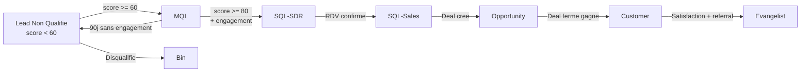

# Lead Scoring -- Regles de Qualification

> [!info] Vue d'ensemble
> Score composite sur **100 points** calcule a partir de criteres Contact (60 pts) et Company (40 pts).
> - **Seuil MQL** : score >= 60
> - **Seuil SQL** : score >= 80
> Voir [[leadgen/pipeline-overview]] pour le flux complet et [[crm/hubspot-lifecycle]] pour les transitions de lifecycle.

---

## Score Composite -- Structure

| Categorie | Points max | Poids relatif |
|-----------|-----------|---------------|
| **Contact** | 60 pts | 60% |
| **Company** | 40 pts | 40% |
| **Total** | **100 pts** | 100% |

---

## Criteres de Scoring Contact (60 pts max)

### 1. Job Title Match (max 25 pts)

Le matching se base sur les `jobTitleRules` definies dans le [[leadgen/cleaning-rules|GMT (Global Mapping Table)]]. Chaque titre a un poids de 1 a 3.

| Job Title | Poids | Points |
|-----------|-------|--------|
| CFO / DAF | 3 | 25 |
| Finance Director | 3 | 25 |
| Head of Finance | 2 | 17 |
| Managing Director | 2 | 17 |
| Controller / RAF | 1 | 8 |

> [!note] Calcul
> `points = (poids / 3) * 25`, arrondi a l'entier.
> Les titres non reconnus mais dans le domaine finance recoivent un poids de 1 par defaut.
> Les titres dans les **exclusions** (Marketing, HR, Sales, IT, Operations) declenchent une [[#Regles de Disqualification Automatique|disqualification automatique]].

Voir [[business/icp-personas]] pour le mapping complet persona-titre.

### 2. Seniority / Level (max 15 pts)

| Niveau | Points |
|--------|--------|
| C-Level (CEO, CFO, COO, CTO) | 15 |
| VP (Vice President) | 12 |
| Director | 10 |
| Manager | 5 |
| Other / Non determine | 0 |

> [!tip] Source de donnees
> Le champ `seniority` est enrichi via [[leadgen/enrichment-phantom|PhantomBuster]] ou [[leadgen/enrichment-fullenrich|FullEnrich]], puis stocke dans la propriete HubSpot `hs_seniority`. Voir [[crm/hubspot-properties]].

### 3. Email Quality (max 10 pts)

| Type d'email | Points |
|--------------|--------|
| Domaine professionnel (ex: `@entreprise.com`) | 10 |
| Domaine generique (gmail, hotmail, yahoo, outlook) | 2 |
| Email bounced / invalide | 0 |

> [!warning] Email bounced
> Un email bounced sans alternative valide entraine une **disqualification** si c'est le seul moyen de contact. Voir [[leadgen/cleaning-rules]] pour les regles de nettoyage email.

### 4. LinkedIn Profile Complet (max 5 pts)

| Statut | Points |
|--------|--------|
| Profil LinkedIn URL valide et complete | 5 |
| Pas de profil ou profil incomplet | 0 |

### 5. Phone Available (max 5 pts)

| Statut | Points |
|--------|--------|
| Numero de telephone valide | 5 |
| Pas de telephone | 0 |

---

## Criteres de Scoring Company (40 pts max)

### 1. Industry Match (max 15 pts)

Basee sur la liste `industry_emalist` du [[leadgen/cleaning-gmt|GMT]].

| Match | Industries | Points |
|-------|-----------|--------|
| **Exact ICP** | Manufacturing, Professional Services, Technology, Healthcare, Financial Services | 15 |
| **Adjacent** | Retail, Logistics, Construction, Education, Real Estate | 8 |
| **Non-cible** | Toutes les autres | 0 |

Voir [[business/icp-personas]] pour la definition complete de l'ICP.

### 2. Company Size -- Employees Category (max 10 pts)

Basee sur le champ `employees_category` du [[leadgen/cleaning-gmt|GMT]].

| Tranche | Points | Justification |
|---------|--------|---------------|
| 51-200 | 10 | Sweet spot EMAsphere |
| 201-500 | 10 | Sweet spot EMAsphere |
| 501-1000 | 8 | Grand compte, cycle plus long |
| 11-50 | 5 | PME, potentiel mais budget limite |
| 1001+ | 3 | Enterprise, tres long cycle |
| 1-10 | 0 | Trop petit, pas de besoin |

### 3. Geographic Hub (max 10 pts)

Basee sur le `country` et le `NAD` (National Administrative Division). Voir [[leadgen/geographic-hubs]] pour le routing complet.

| Marche | Pays | Points |
|--------|------|--------|
| **Primaire** | France, Belgique | 10 |
| **Secondaire** | UK, Ireland | 7 |
| **ROW** | Tous les autres | 3 |

### 4. Digital Presence (max 5 pts)

| Critere | Points |
|---------|--------|
| Domaine web disponible | 3 |
| Page LinkedIn entreprise | 2 |
| Aucun | 0 |

---

## Regles de Disqualification Automatique

> [!danger] Score = 0, lead envoye au Bin
> Les regles suivantes forcent le score a **zero** et dirigent le lead vers le Bin (suppression du pipeline actif). Elles sont prioritaires sur tout scoring positif.

| Regle | Condition | Action |
|-------|-----------|--------|
| **Job Title Exclu** | Titre dans exclusions : Marketing, HR, Sales, IT, Operations | Score = 0, Bin |
| **Email Bounced Unique** | Email bounced ET aucune alternative (pas de phone, pas de LinkedIn) | Score = 0, Bin |
| **Micro-entreprise Non-cible** | Entreprise < 10 employes ET industrie non-cible (hors ICP et adjacent) | Score = 0, Bin |

> [!note] Negative Personas
> Les exclusions de job title correspondent aux **negative personas** definis dans [[business/icp-personas]]. Ces profils ne sont jamais des decision-makers pour une solution de reporting financier.

---

## Lifecycle Transitions

| Stage | Score | Condition supplementaire |
|-------|-------|-------------------------|
| Lead Non Qualifie | < 60 | Import initial |
| MQL | >= 60 | -- |
| SQL-SDR | >= 80 | Engagement detecte (email ouvert, clic, reponse) |
| SQL-Sales | >= 80 | Rendez-vous confirme avec le commercial |
| Opportunity | -- | Deal cree dans [[crm/hubspot-lifecycle|HubSpot]] |
| Customer | -- | Deal ferme gagne |
| Evangelist | -- | Client satisfait, potentiel referral/upsell |

Voir [[crm/hubspot-lifecycle]] pour les details complets des lifecycle stages.

---

## Table de Mapping Score vers Action

| Score | Qualification | Action | Responsable | Outil |
|-------|--------------|--------|-------------|-------|
| 0 (disqualifie) | Bin | Suppression du pipeline actif | Automatique | [[crm/hubspot-workflows]] |
| 1-59 | Lead Non Qualifie | Nurture sequence ou archivage | Automatique | [[campaigns/lemlist-sequences]] |
| 60-79 | **MQL** | Enrollment campagne Lemlist, suivi marketing | Aria / Marketing | [[campaigns/lemlist-sequences]] |
| 80-100 | **SQL-SDR** | Assignation immediate au SDR, premier contact sous 24h | SDR Hub | [[crm/hubspot-workflows]] |

> [!success] Objectif
> Le scoring permet de concentrer l'effort commercial sur les leads les plus qualifies (SQL >= 80) tout en maintenant un nurture pour les MQL (60-79) qui peuvent monter en qualification avec le temps.

---

## Implementation Technique

### Proprietes HubSpot Associees

| Propriete | Type | Usage |
|-----------|------|-------|
| `lead_score_contact` | Number | Sous-score contact (0-60) |
| `lead_score_company` | Number | Sous-score company (0-40) |
| `lead_score_total` | Number | Score composite (0-100) |
| `lead_qualification` | Dropdown | BIN, LEAD, MQL, SQL_SDR, SQL_SALES |
| `disqualification_reason` | Text | Raison si score = 0 |

Voir [[crm/hubspot-properties]] pour la liste complete des proprietes.

### Calcul du Score

Le score est calcule :
1. **A l'import** par le workflow [[crm/hubspot-workflows|wf-new-lead]]
2. **Apres enrichissement** par [[leadgen/enrichment-fullenrich|FullEnrich]] ou [[leadgen/enrichment-phantom|PhantomBuster]]
3. **Manuellement** via recalcul batch si les regles changent

---

## Liens

- [[leadgen/pipeline-overview]] -- Vue d'ensemble du pipeline leadgen
- [[leadgen/cleaning-rules]] -- Regles de nettoyage des donnees
- [[leadgen/cleaning-gmt]] -- Global Mapping Table (jobTitleRules, industry_emalist)
- [[crm/hubspot-properties]] -- Proprietes HubSpot
- [[crm/hubspot-lifecycle]] -- Lifecycle stages et funnel
- [[prospects/pipeline]] -- Pipeline prospects actif
- [[business/icp-personas]] -- ICP et buyer personas
- [[campaigns/lemlist-sequences]] -- Sequences outreach
