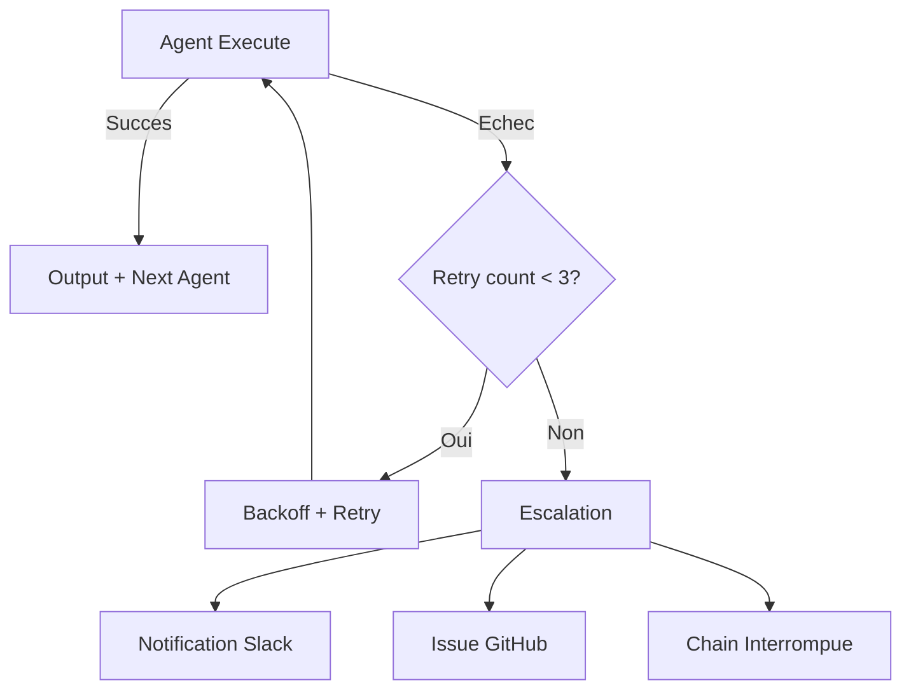

# Workflows Agents -- Chaines & Orchestration

> [!info] Vue d'ensemble
> Le systeme multi-agents repose sur des chaines d'execution orchestrees par GitHub Actions. Chaque agent a un role specialise et communique via des fichiers JSON standardises. L'orchestration gere le parallelisme, le sequencement, et les retries.

---

## Pipeline Principal (Orchestrator)

```
Issue/PR/Schedule --> Gate --> Orchestrate --> [Researcher + Analyzer] (parallel) --> Coder --> Tester --> Aggregate
```

### Etapes du Pipeline

| Etape | Role | Description |
|-------|------|-------------|
| **Gate** | Validation | Verifie que le trigger est valide, que les secrets sont disponibles, que le contexte est suffisant |
| **Orchestrate** | Planification | Decompose la tache en sous-taches, determine les agents necessaires et l'ordre d'execution |
| **Researcher** | Collecte | Agents de recherche (Scout, Iris) collectent les donnees necessaires en parallele |
| **Analyzer** | Analyse | Agents d'analyse (Lumen, Nexus) traitent les donnees en parallele |
| **Coder** | Implementation | Forge implemente les changements necessaires |
| **Tester** | Validation | Sentinel verifie la qualite et les tests |
| **Aggregate** | Synthese | Resultats consolides, rapport genere, PR creee si necessaire |

---

## Chaines d'Agents par Use Case

### Lead Generation

| Etape | Agent | Action | Input | Output |
|-------|-------|--------|-------|--------|
| 1 | [[agents/scout-memory\|Scout]] | Scraping sources, extraction prospects | URLs sources, criteres ICP | Liste brute de prospects |
| 2 | [[agents/aria-memory\|Aria]] | Nettoyage, enrichissement, scoring, import CRM | Liste brute | Contacts HubSpot importes |
| 3 | (HubSpot) | Workflows automatiques (hub, lifecycle, sequence) | Contacts importes | Leads qualifies et assignes |

```
Trigger: workflow_dispatch, repository_dispatch
Schedule: --
Frequence: A la demande
```

### Google Ads Audit

| Etape | Agent | Action | Input | Output |
|-------|-------|--------|-------|--------|
| 1 | [[agents/nexus-memory\|Nexus]] | Extraction metriques Google Ads, analyse performance | Account ID, periode | Donnees brutes + analyse |
| 2 | [[agents/lumen-memory\|Lumen]] | Synthese, recommandations, rapport | Analyse Nexus | Rapport structure |

```
Trigger: schedule (cron), manual
Schedule: Lundi 8h UTC
Frequence: Hebdomadaire
```

> [!warning] Regles Google Ads MCP
> Nexus doit respecter les regles critiques du [[tech/mcp-servers|MCP Google Ads]] : pas de `.type` dans conditions, pas d'appels paralleles, pas de `metrics.optimization_score` avec date segments.

### Email Digest

| Etape | Agent | Action | Input | Output |
|-------|-------|--------|-------|--------|
| 1 | [[agents/iris-memory\|Iris]] | Fetch emails (Gmail API) | Credentials Gmail | Emails bruts |
| 2 | Iris | Triage (priorite, categorie, action requise) | Emails bruts | Emails tries et categorises |
| 3 | Iris | Draft reponses, resume, actions suggerees | Emails tries | Digest + drafts |

```
Trigger: schedule (cron)
Schedule: Lun-Ven 7h30 UTC, Sam-Dim 9h30 UTC
Frequence: Quotidienne
```

### Self-Improvement

| Etape | Agent | Action | Input | Output |
|-------|-------|--------|-------|--------|
| 1 | [[agents/sage-memory\|Sage]] | Collecte retrospectives de tous les agents | Fichiers retrospective | Donnees aggregees |
| 2 | Sage | Analyse patterns, detection skills candidats, recommandations | Donnees aggregees | Analyse + candidats skills |
| 3 | [[agents/forge-memory\|Forge]] | Implementation des ameliorations (skills, config, workflows) | Recommandations Sage | PR avec changements |

```
Trigger: schedule (cron)
Schedule: Dimanche 9h UTC
Frequence: Hebdomadaire
```

### Code Change

| Etape | Agent | Action | Input | Output |
|-------|-------|--------|-------|--------|
| 1 | [[agents/forge-memory\|Forge]] | Implementation du changement (code, config, doc) | Issue / spec | Branch + commits |
| 2 | [[agents/sentinel-memory\|Sentinel]] | Tests, linting, review code, security check | Branch Forge | Rapport test + approbation |
| 3 | (PR) | Pull Request creee si tests passes | Approbation Sentinel | PR prete pour merge |

```
Trigger: dispatch, PR event
Schedule: --
Frequence: A la demande
```

### Web Intelligence

| Etape | Agent | Action | Input | Output |
|-------|-------|--------|-------|--------|
| 1 | [[agents/scout-memory\|Scout]] | Scraping web (Firecrawl / Playwright) | URLs, mots-cles | Contenu brut |
| 2 | [[agents/lumen-memory\|Lumen]] | Analyse, synthese, extraction insights | Contenu brut | Rapport d'intelligence |

```
Trigger: dispatch
Schedule: --
Frequence: A la demande
```

### Full Pipeline

| Etape | Agent | Action |
|-------|-------|--------|
| 1 | Scout | Scraping et collecte |
| 2 | Aria | Nettoyage et CRM |
| 3 | Nexus | Ads et metriques |
| 4 | Iris | Communications |
| 5 | Lumen | Aggregation et rapport final |

```
Trigger: repository_dispatch: full-workflow
Schedule: --
Frequence: Exceptionnel (pipeline complet)
```

---

## Communication Inter-Agents

### Format Standard

Les agents communiquent via des fichiers JSON dans `/tmp/` :

**Input : `/tmp/agent_task.json`**

```json
{
  "task_id": "task-2026-03-28-001",
  "agent": "scout",
  "action": "scrape_prospects",
  "params": {
    "sources": ["linkedin", "crunchbase"],
    "criteria": {
      "industry": "Manufacturing",
      "country": "France",
      "employees_min": 50,
      "employees_max": 500
    }
  },
  "context": {
    "triggered_by": "ralph",
    "chain": "lead-generation",
    "step": 1,
    "total_steps": 3
  },
  "timeout_minutes": 30
}
```

**Output : `/tmp/agent_result.json`**

```json
{
  "task_id": "task-2026-03-28-001",
  "agent": "scout",
  "status": "completed",
  "started_at": "2026-03-28T08:00:00Z",
  "completed_at": "2026-03-28T08:12:34Z",
  "result": {
    "prospects_found": 150,
    "prospects_file": "/tmp/prospects_raw.json",
    "sources_scraped": 3,
    "errors": []
  },
  "next_agent": "aria",
  "retrospective": {
    "what_worked": "Firecrawl skill rapide et fiable",
    "what_failed": null,
    "mcp_patterns": ["firecrawl_scrape: 15 calls"],
    "improvement_suggestion": null
  }
}
```

> [!note] Retrospectives
> Chaque agent inclut une section `retrospective` dans son output. Ces donnees sont collectees par [[agents/sage-memory|Sage]] pour le cycle de self-improvement. Voir [[tech/skills-registry]] pour la detection de patterns MCP.

---

## Ralph comme Routeur

[[agents/ralph-memory|Ralph]] est l'agent de dispatch. Il recoit les `repository_dispatch` events et les route vers l'agent ou la chaine appropriee.

### Events de Dispatch

| Event Type | Payload | Chaine Declenchee |
|------------|---------|-------------------|
| `lead-generation` | `{ "sources": [...], "criteria": {...} }` | Scout --> Aria |
| `google-ads-audit` | `{ "period": "last_30_days" }` | Nexus --> Lumen |
| `email-digest` | `{ "mode": "daily" }` | Iris (3 steps) |
| `self-improvement` | `{}` | Sage --> Forge |
| `code-change` | `{ "issue_number": 123 }` | Forge --> Sentinel |
| `web-intelligence` | `{ "urls": [...], "prompt": "..." }` | Scout --> Lumen |
| `full-workflow` | `{ "all": true }` | Scout --> Aria --> Nexus --> Iris --> Lumen |
| `health-check` | `{}` | Sentinel (verification secrets + workflows) |

### Logique de Routing

```python
# Pseudo-code du routing Ralph
def route_dispatch(event_type, payload):
    chains = {
        "lead-generation": ["scout", "aria"],
        "google-ads-audit": ["nexus", "lumen"],
        "email-digest": ["iris"],
        "self-improvement": ["sage", "forge"],
        "code-change": ["forge", "sentinel"],
        "web-intelligence": ["scout", "lumen"],
        "full-workflow": ["scout", "aria", "nexus", "iris", "lumen"],
    }

    chain = chains.get(event_type)
    if not chain:
        log_error(f"Unknown event type: {event_type}")
        return

    for agent in chain:
        result = dispatch_agent(agent, payload)
        if result["status"] != "completed":
            handle_failure(agent, result)
            break
        payload = result  # output becomes next input
```

Voir [[agents/ralph-memory]] et [[agents/dispatch-log]] pour les logs de dispatch.

---

## Regles de Retry

> [!warning] Regles Strictes
> Les retries sont limites pour eviter les boucles infinies et le gaspillage de tokens.

| Regle | Detail |
|-------|--------|
| **Max cycles** | 3 tentatives par agent par tache |
| **Backoff** | Exponentiel : 1 min, 5 min, 15 min |
| **Jamais marquer complete sans artifacts** | Un agent ne peut pas dire "complete" sans produire un fichier de resultat |
| **Escalation** | Apres 3 echecs, notification Slack + issue GitHub |
| **Timeout** | 30 min par agent (configurable dans la tache) |
| **Idempotence** | Les agents doivent etre idempotents (re-execution sans effet de bord) |

### Gestion des Echecs



---

## DRY_RUN Mode

> [!danger] Regle Critique
> Toute modification externe **irreversible** doit d'abord etre executee en mode DRY_RUN pour preview.

| Operation | DRY_RUN Action | Production Action |
|-----------|---------------|-------------------|
| Import HubSpot | Log "Would create X contacts" | Batch create contacts |
| Envoi email Lemlist | Log "Would send to X leads" | Enrollment reel |
| Google Ads bid change | Log "Would change bid to X" | Apply bid change |
| GitHub PR merge | Log "Would merge PR #X" | Merge PR |
| Suppression contacts | Log "Would delete X contacts" | Delete contacts |

Le DRY_RUN est active par defaut sur les nouvelles chaines. Il doit etre explicitement desactive apres validation humaine.

```json
{
  "task_id": "...",
  "params": {
    "dry_run": true,
    "action": "hubspot_batch_create"
  }
}
```

---

## Schedules Actifs

| Chaine | Cron | Heure (UTC) | Jours |
|--------|------|-------------|-------|
| Email Digest | `30 7 * * 1-5` | 7h30 | Lun-Ven |
| Email Digest (weekend) | `30 9 * * 0,6` | 9h30 | Sam-Dim |
| Google Ads Audit | `0 8 * * 1` | 8h00 | Lundi |
| Self-Improvement | `0 9 * * 0` | 9h00 | Dimanche |
| Health Check | `0 6 * * *` | 6h00 | Tous les jours |
| Dedup HubSpot | `0 6 * * 1` | 6h00 | Lundi |

---

## Liens

- [[agents/dispatch-log]] -- Log de tous les dispatches
- [[agents/ralph-memory]] -- Ralph (routeur principal)
- [[agents/sage-memory]] -- Sage (self-improvement)
- [[agents/forge-memory]] -- Forge (implementation)
- [[agents/sentinel-memory]] -- Sentinel (tests et validation)
- [[tech/infrastructure]] -- Infrastructure technique
- [[tech/mcp-servers]] -- Serveurs MCP utilises
- [[tech/skills-registry]] -- Skills autonomes
- [[operations/runbooks]] -- Runbooks operationnels
- [[operations/decisions]] -- Log des decisions architecturales
- [[operations/kpis]] -- KPIs de performance des agents
