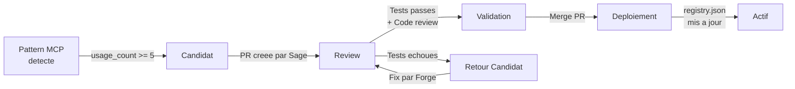

# Skills Registry -- MCP vers Scripts Autonomes

> [!info] Vue d'ensemble
> Le skills registry est le mecanisme par lequel les patterns MCP recurrents sont convertis en **scripts Python autonomes**, plus rapides, moins couteux en tokens, et plus fiables. Ce processus est pilote par [[agents/sage-memory|Sage]] (detection) et [[agents/forge-memory|Forge]] (implementation).

---

## Concept

### Pourquoi les Skills ?

Les serveurs MCP ([[tech/mcp-servers]]) sont puissants mais couteux :

| Aspect | MCP Direct | Skill Autonome |
|--------|-----------|----------------|
| **Tokens Claude** | Eleve (handshake MCP + tool description + tool call + response parsing) | Quasi-nul (appel script direct) |
| **Temps d'execution** | 5-15 secondes (demarrage serveur + appel) | 1-3 secondes (script Python) |
| **Fiabilite** | Dependant du serveur MCP et du reseau | Script teste et valide, execution locale |
| **Maintenance** | Mise a jour du package MCP (breaking changes possibles) | Controle total du code |
| **Cout API** | Tokens Claude + tokens API externe | API externe uniquement |

> [!tip] Regle d'or
> Un agent DOIT toujours verifier `skills/registry.json` **avant** d'utiliser un serveur MCP directement. Si un skill valide existe pour l'operation, il est **obligatoire** de l'utiliser.

---

## Les 4 Skills Valides

### 1. firecrawl_scrape

| Attribut | Valeur |
|----------|--------|
| **Fichier** | `skills/validated/firecrawl_scrape.py` |
| **Usage** | Scraping web RGPD-compliant d'une URL |
| **Remplace** | MCP `firecrawl.firecrawl_scrape` |
| **Agents** | [[agents/scout-memory\|Scout]], [[agents/iris-memory\|Iris]] |
| **Secret requis** | `FIRECRAWL_API_KEY` |

```bash
python3 skills/validated/firecrawl_scrape.py --url "https://example.com" [--format markdown] [--output /tmp/result.json]
```

**Parametres :**

| Parametre | Requis | Default | Description |
|-----------|--------|---------|-------------|
| `--url` | Oui | -- | URL a scraper |
| `--format` | Non | `markdown` | Format de sortie (`markdown`, `html`, `text`) |
| `--output` | Non | stdout | Fichier de sortie |
| `--timeout` | Non | `30` | Timeout en secondes |

**Sortie :** JSON avec `{ "url", "title", "content", "metadata" }`

---

### 2. github_create_issue

| Attribut | Valeur |
|----------|--------|
| **Fichier** | `skills/validated/github_create_issue.py` |
| **Usage** | Creation d'issues GitHub |
| **Remplace** | MCP `github.create_issue` |
| **Agents** | Tous |
| **Secret requis** | `GITHUB_TOKEN` |

```bash
python3 skills/validated/github_create_issue.py \
  --title "Titre de l'issue" \
  --body "Description detaillee" \
  [--repo "GaspardCoche/agent-system"] \
  [--labels "bug,priority:high"] \
  [--assignees "agent-name"]
```

**Parametres :**

| Parametre | Requis | Default | Description |
|-----------|--------|---------|-------------|
| `--title` | Oui | -- | Titre de l'issue |
| `--body` | Oui | -- | Corps de l'issue (Markdown) |
| `--repo` | Non | `GaspardCoche/agent-system` | Repository cible |
| `--labels` | Non | -- | Labels separes par des virgules |
| `--assignees` | Non | -- | Assignees separes par des virgules |

**Sortie :** JSON avec `{ "number", "url", "html_url" }`

---

### 3. gemini_analyze

| Attribut | Valeur |
|----------|--------|
| **Fichier** | `skills/validated/gemini_analyze.py` |
| **Usage** | Analyse de gros fichiers (>50KB) via Gemini API |
| **Remplace** | Pas de MCP equivalent (complement a Claude) |
| **Agents** | Orchestrator, [[agents/sage-memory\|Sage]], [[agents/nexus-memory\|Nexus]], [[agents/iris-memory\|Iris]], [[agents/lumen-memory\|Lumen]] |
| **Secret requis** | `GEMINI_API_KEY` |

```bash
python3 skills/validated/gemini_analyze.py \
  --file "/tmp/large_report.csv" \
  --prompt "Analyse les tendances principales et identifie les anomalies"
```

**Parametres :**

| Parametre | Requis | Default | Description |
|-----------|--------|---------|-------------|
| `--file` | Oui | -- | Chemin du fichier a analyser |
| `--prompt` | Oui | -- | Instruction d'analyse |
| `--model` | Non | `gemini-2.0-flash` | Modele Gemini |
| `--output` | Non | stdout | Fichier de sortie |
| `--max-tokens` | Non | `8192` | Limite de tokens de reponse |

> [!note] Quand utiliser Gemini vs Claude
> **Gemini** est prefere pour les fichiers > 50KB (contexte plus large, moins cher) et les analyses de donnees tabulaires. **Claude** reste prefere pour le raisonnement complexe, le code, et les decisions strategiques.

**Sortie :** JSON avec `{ "analysis", "model", "tokens_used" }`

---

### 4. slack_notify

| Attribut | Valeur |
|----------|--------|
| **Fichier** | `skills/validated/slack_notify.py` |
| **Usage** | Envoi de notifications Slack via webhook |
| **Remplace** | Appel curl direct au webhook |
| **Agents** | Tous |
| **Secret requis** | `SLACK_WEBHOOK_URL` |

```bash
python3 skills/validated/slack_notify.py \
  --message "Pipeline leadgen termine: 150 leads importes" \
  [--channel "#agent-notifications"] \
  [--emoji ":robot_face:"]
```

**Parametres :**

| Parametre | Requis | Default | Description |
|-----------|--------|---------|-------------|
| `--message` | Oui | -- | Message a envoyer |
| `--channel` | Non | Webhook default | Channel cible |
| `--emoji` | Non | `:robot_face:` | Emoji du bot |
| `--blocks` | Non | -- | Blocks JSON pour message riche |

**Sortie :** `{ "ok": true }` ou erreur

---

## Cycle de Vie d'un Skill



### Etapes Detaillees

| Etape | Acteur | Actions | Criteres de Passage |
|-------|--------|---------|---------------------|
| **1. Detection** | [[agents/sage-memory\|Sage]] | Analyse des retrospectives, comptage `usage_count` par pattern MCP | `usage_count >= 5` sur les 30 derniers jours |
| **2. Candidature** | Sage | Cree une entree dans `skills/candidates/`, documente le pattern | Pattern clairement identifie et reproductible |
| **3. Implementation** | [[agents/forge-memory\|Forge]] | Ecrit le script Python, les tests, la doc | Script fonctionnel, tests unitaires passes |
| **4. PR** | Sage | Cree une PR GitHub avec le skill et les tests | PR propre, description complete |
| **5. Review** | Humain + [[agents/sentinel-memory\|Sentinel]] | Review code, securite, tests | Tous les checks passes, pas de secret en clair |
| **6. Validation** | Humain | Merge de la PR | Approbation explicite |
| **7. Deploiement** | Forge | Deplace de `candidates/` a `validated/`, met a jour `registry.json` | `registry.json` a jour |
| **8. Adoption** | Tous les agents | Utilisent le skill au lieu du MCP | Verification automatique via `registry.json` |

---

## Structure de registry.json

```json
{
  "skills": [
    {
      "name": "firecrawl_scrape",
      "file": "skills/validated/firecrawl_scrape.py",
      "replaces_mcp": "firecrawl.firecrawl_scrape",
      "agents": ["scout", "iris"],
      "version": "1.0.0",
      "validated_date": "2026-03-15",
      "usage_count": 42
    },
    {
      "name": "github_create_issue",
      "file": "skills/validated/github_create_issue.py",
      "replaces_mcp": "github.create_issue",
      "agents": ["all"],
      "version": "1.0.0",
      "validated_date": "2026-03-18",
      "usage_count": 28
    },
    {
      "name": "gemini_analyze",
      "file": "skills/validated/gemini_analyze.py",
      "replaces_mcp": null,
      "agents": ["orchestrator", "sage", "nexus", "iris", "lumen"],
      "version": "1.1.0",
      "validated_date": "2026-03-20",
      "usage_count": 15
    },
    {
      "name": "slack_notify",
      "file": "skills/validated/slack_notify.py",
      "replaces_mcp": null,
      "agents": ["all"],
      "version": "1.0.0",
      "validated_date": "2026-03-22",
      "usage_count": 8
    }
  ],
  "candidates": [
    {
      "name": "hubspot_batch_create",
      "pattern": "hubspot.hubspot-batch-create-objects",
      "usage_count": 3,
      "first_seen": "2026-03-10",
      "agents": ["aria"],
      "status": "monitoring"
    }
  ],
  "last_updated": "2026-03-28T00:00:00Z"
}
```

---

## Regle pour les Agents

> [!danger] Regle Obligatoire
> Avant toute utilisation d'un serveur MCP, l'agent DOIT executer :
> ```bash
> cat skills/registry.json | python3 -c "
> import json, sys
> registry = json.load(sys.stdin)
> for skill in registry['skills']:
>     if skill['replaces_mcp'] == 'TARGET_MCP_TOOL':
>         print(f'USE SKILL: {skill[\"file\"]}')
>         sys.exit(0)
> print('NO SKILL FOUND, USE MCP')
> "
> ```
> Si un skill est trouve, il **doit** etre utilise. L'utilisation directe du MCP quand un skill existe est consideree comme une erreur de process.

---

## Skills Potentiels Futurs

| Skill | MCP Remplace | Usage | Agents | Status |
|-------|-------------|-------|--------|--------|
| `hubspot_batch_create` | `hubspot.hubspot-batch-create-objects` | Import batch de leads dans HubSpot | [[agents/aria-memory\|Aria]] | Candidat (usage_count=3) |
| `phantom_launch` | Pas de MCP | Lancement d'un Phantom PhantomBuster | [[agents/scout-memory\|Scout]] | Observe |
| `fullenrich_submit` | Pas de MCP | Soumission d'enrichissement FullEnrich | [[agents/aria-memory\|Aria]] | Observe |
| `sheets_update` | Pas de MCP | Mise a jour Google Sheets | [[agents/scout-memory\|Scout]], [[agents/lumen-memory\|Lumen]] | Observe |
| `lemlist_enroll` | `lemlist.add_lead_to_campaign` | Enrollment lead dans sequence Lemlist | [[agents/iris-memory\|Iris]], [[agents/aria-memory\|Aria]] | Observe |
| `hubspot_batch_dedup` | `hubspot.hubspot-search-objects` (multiple) | Deduplication batch contacts HubSpot | [[agents/aria-memory\|Aria]] | Observe |

---

## Metriques du Registry

| Metrique | Valeur Actuelle | Objectif |
|----------|----------------|----------|
| Skills valides | 4 | 8 d'ici Q2 2026 |
| Skills candidats | 1 | -- |
| Tokens economises (estime) | ~15K/semaine | 30K/semaine |
| Temps economise (estime) | ~10 min/semaine | 20 min/semaine |
| Taux d'adoption (skill vs MCP) | ~60% | > 90% |

Voir [[operations/kpis]] pour le suivi des metriques d'efficacite des agents.

---

## Liens

- [[tech/mcp-servers]] -- Serveurs MCP (source des patterns)
- [[tech/infrastructure]] -- Infrastructure technique globale
- [[agents/sage-memory]] -- Sage (detection et candidature)
- [[agents/forge-memory]] -- Forge (implementation)
- [[agents/sentinel-memory]] -- Sentinel (review et tests)
- [[operations/kpis]] -- Metriques de performance
